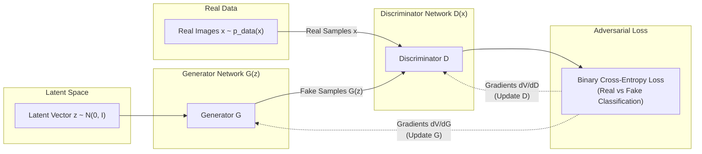

# Generative Adversarial Networks (GAN) & DCGAN Exploration

[](LICENSE)
[](https://www.python.org/)
[](https://www.tensorflow.org/)
[]()

A comprehensive implementation, theoretical breakdown, and experimental benchmark of **Generative Adversarial Networks (GANs)** and **Deep Convolutional GANs (DCGANs)** in TensorFlow/Keras. This repository bridges mathematical foundations with practical, reproducible code—spanning 1D toy distributions, universal function approximation, full 64×64 image synthesis, and CPU vs. GPU acceleration benchmarks.

---

## Table of Contents

- [Project Overview](#project-overview)
- [How GANs Work: Core Theory & Mathematics](#how-gans-work-core-theory--mathematics)
  - [The Minimax Game Formulation](#the-minimax-game-formulation)
  - [The Optimal Discriminator & Jensen-Shannon Divergence](#the-optimal-discriminator--jensen-shannon-divergence)
  - [Non-Saturating Heuristic Loss](#non-saturating-heuristic-loss)
  - [Key Training Challenges](#key-training-challenges)
- [Deep Convolutional GAN (DCGAN)](#deep-convolutional-gan-dcgan)
  - [Why Standard MLPs Fail on Images](#why-standard-mlps-fail-on-images)
  - [Radford et al. Architectural Principles](#radford-et-al-architectural-principles)
  - [Network Architecture Blueprint](#network-architecture-blueprint)
  - [Latent Space Arithmetic & Interpolation](#latent-space-arithmetic--interpolation)
- [Repository Structure](#repository-structure)
- [Installation & Quickstart](#installation--quickstart)
- [Running Experiments](#running-experiments)
  - [1. 1D Distribution Matching (Vanilla GAN)](#1-1d-distribution-matching-vanilla-gan)
  - [2. 64x64 Image Synthesis (DCGAN)](#2-64x64-image-synthesis-dcgan)
  - [3. GPU vs. CPU Performance Benchmarks](#3-gpu-vs-cpu-performance-benchmarks)
  - [4. Running Unit & Smoke Tests](#4-running-unit--smoke-tests)
- [CLI Reference](#cli-reference)
- [References](#references)

---

## Project Overview

Generative Adversarial Networks, introduced by [Goodfellow et al. (2014)](https://arxiv.org/abs/1406.2661), formulated generative modeling as an adversarial game between two deep neural networks:
1. **Generator ($G$)**: Captures the data distribution and generates synthetic samples from a latent noise prior.
2. **Discriminator ($D$)**: Evaluates samples and estimates the probability that a given sample came from the real training data rather than from $G$.

This repository provides an end-to-end sandbox to study, train, and visualize GANs across multiple domains:



---

## How GANs Work: Core Theory & Mathematics

### The Minimax Game Formulation

GAN training is rooted in two-player zero-sum game theory. The objective function is defined by the value function $V(D, G)$:

$$\min_{G} \max_{D} V(D, G) = \mathbb{E}_{x \sim p_{\text{data}}(x)} \left[\log D(x)\right] + \mathbb{E}_{z \sim p_z(z)} \left[\log \left(1 - D(G(z))\right)\right]$$

- **Discriminator's Goal**: Maximize $V(D, G)$ by correctly classifying real samples ($D(x) \to 1$) and fake samples ($D(G(z)) \to 0$).
- **Generator's Goal**: Minimize $V(D, G)$ by fooling the discriminator into classifying generated samples as real ($D(G(z)) \to 1$).

---

### The Optimal Discriminator & Jensen-Shannon Divergence

For any fixed generator $G$, the optimal discriminator $D^*_G(x)$ that maximizes $V(D, G)$ can be derived analytically by taking functional derivatives:

$$D^*_G(x) = \frac{p_{\text{data}}(x)}{p_{\text{data}}(x) + p_g(x)}$$

When $D = D^*_G$, the minimax objective simplifies to:

$$V(D^*_G, G) = -\log(4) + 2 \cdot D_{\text{JS}}\left(p_{\text{data}} \parallel p_g\right)$$

where $D_{\text{JS}}$ is the **Jensen-Shannon Divergence**:

$$D_{\text{JS}}(p_{\text{data}} \parallel p_g) = \frac{1}{2} D_{\text{KL}}\left(p_{\text{data}} \parallel \frac{p_{\text{data}} + p_g}{2}\right) + \frac{1}{2} D_{\text{KL}}\left(p_g \parallel \frac{p_{\text{data}} + p_g}{2}\right)$$

- The global minimum occurs **if and only if** $p_g = p_{\text{data}}$.
- At this equilibrium, $D^*(x) = \frac{1}{2}$ everywhere, meaning the discriminator is completely unable to distinguish real data from synthetic data.

---

### Non-Saturating Heuristic Loss

In early training iterations, when $G$ generates poor quality samples, $D$ easily rejects them with high confidence ($D(G(z)) \approx 0$). In this regime, the derivative $\nabla_{\theta_g} \log(1 - D(G(z)))$ saturates (vanishes), leading to extremely slow or stalled learning.

To address this, the minimax generator loss is replaced in practice with the **Non-Saturating Loss**:

$$\mathcal{L}_G = -\mathbb{E}_{z \sim p_z(z)}\left[\log D(G(z))\right]$$

In our implementation, this is achieved by computing standard Binary Cross-Entropy against target labels of `1` (`tf.ones_like(fake_output)`):

```python
cross_entropy = tf.keras.losses.BinaryCrossentropy(from_logits=True)

def generator_loss(fake_output):
    # Train G to make D output 1 (real) for synthetic samples
    return cross_entropy(tf.ones_like(fake_output), fake_output)

def discriminator_loss(real_output, fake_output):
    real_loss = cross_entropy(tf.ones_like(real_output), real_output)
    fake_loss = cross_entropy(tf.zeros_like(fake_output), fake_output)
    return 0.5 * (real_loss + fake_loss)
```

---

### Key Training Challenges

1. **Mode Collapse**: The generator learns to output only a small subset of valid modes (e.g., producing only one face or one digit repeatedly) rather than capturing the full diversity of $p_{\text{data}}$.
2. **Vanishing Gradients**: If the discriminator becomes too strong relative to the generator too early, gradients approaching zero halt generator learning.
3. **Non-Convergence & Oscillations**: Gradient descent in a minimax game can enter limit cycles rather than converging to a Nash equilibrium if learning rates or momentum terms are unbalanced.

---

## Deep Convolutional GAN (DCGAN)

### Why Standard MLPs Fail on Images
Fully connected networks (MLPs) ignore 2D spatial locality and scale poorly with image dimensions (e.g., a $64 \times 64 \times 3$ image flattened is 12,288 dimensions per hidden unit). This leads to parameter explosion and blurry, incoherent artifacts.

### Radford et al. Architectural Principles

[Radford et al. (2015)](https://arxiv.org/abs/1511.06434) established stable architectural guidelines for Deep Convolutional GANs:

| Guideline | Implementation in this Repository | Purpose |
| :--- | :--- | :--- |
| **No Pooling Layers** | Strided `Conv2D` in Discriminator; Strided `Conv2DTranspose` in Generator | Allows the network to learn spatial downsampling and upsampling |
| **Batch Normalization** | Applied after every conv layer except G output and D input | Stabilizes gradient flow and prevents mode collapse |
| **Direct Spatial Mapping** | Remove dense hidden layers; project $z \in \mathbb{R}^{100}$ directly to spatial tensor | Preserves spatial correlations and reduces parameter count |
| **Generator Activations** | `ReLU` for all hidden layers, `Tanh` for output layer | `Tanh` constrains generated pixels to $[-1, 1]$ |
| **Discriminator Activations**| `LeakyReLU(alpha=0.2)` across all layers | Prevents dead neurons from vanishing gradients |
| **Optimizer Tuning** | Adam with $\alpha = 0.0002$, $\beta_1 = 0.5$, $\beta_2 = 0.999$ | Lower momentum ($\beta_1 = 0.5$) prevents momentum oscillations |
| **Weight Initialization** | `RandomNormal(mean=0.0, stddev=0.02)` | Prevents initial layer saturation |

---

### Network Architecture Blueprint

```
GENERATOR ARCHITECTURE:
Input: Latent Vector z ~ N(0, I) [Shape: (1, 1, 100)]
  │
  ├── Conv2DTranspose (Filters: 512, Kernel: 4x4, Stride: 4, Padding: same) -> (4, 4, 512)
  ├── BatchNormalization + ReLU
  │
  ├── Conv2DTranspose (Filters: 256, Kernel: 4x4, Stride: 2, Padding: same) -> (8, 8, 256)
  ├── BatchNormalization + ReLU
  │
  ├── Conv2DTranspose (Filters: 128, Kernel: 4x4, Stride: 2, Padding: same) -> (16, 16, 128)
  ├── BatchNormalization + ReLU
  │
  ├── Conv2DTranspose (Filters: 64,  Kernel: 4x4, Stride: 2, Padding: same) -> (32, 32, 64)
  ├── BatchNormalization + ReLU
  │
  └── Conv2DTranspose (Filters: 3,   Kernel: 4x4, Stride: 2, Padding: same, Activation: 'tanh') -> (64, 64, 3)

DISCRIMINATOR ARCHITECTURE:
Input: Image Tensor x [Shape: (64, 64, 3)]
  │
  ├── Conv2D (Filters: 64,  Kernel: 4x4, Stride: 2, Padding: same) -> (32, 32, 64)
  ├── LeakyReLU(alpha=0.2)
  │
  ├── Conv2D (Filters: 128, Kernel: 4x4, Stride: 2, Padding: same) -> (16, 16, 128)
  ├── BatchNormalization + LeakyReLU(alpha=0.2)
  │
  ├── Conv2D (Filters: 256, Kernel: 4x4, Stride: 2, Padding: same) -> (8, 8, 256)
  ├── BatchNormalization + LeakyReLU(alpha=0.2)
  │
  ├── Conv2D (Filters: 512, Kernel: 4x4, Stride: 2, Padding: same) -> (4, 4, 512)
  ├── BatchNormalization + LeakyReLU(alpha=0.2)
  │
  └── Conv2D (Filters: 1,   Kernel: 4x4, Stride: 2, Padding: same, Activation: 'sigmoid') -> (1, 1, 1)
```

---

### Latent Space Arithmetic & Interpolation

Because the Generator learns a continuous mapping from $\mathbb{R}^{d} \to \mathcal{X}$, arithmetic in latent space produces smooth semantic transformations in image space:

1. **Linear Interpolation (SLERP / LERP)**: Walking along a straight line $z_{\alpha} = (1 - \alpha) z_1 + \alpha z_2$ produces a smooth morph between two generated identities.
2. **Latent Vector Arithmetic**: Isolating attribute vectors allows vector operations:
   $$\mathbf{z}_{\text{smiling woman}} - \mathbf{z}_{\text{neutral woman}} + \mathbf{z}_{\text{neutral man}} \approx \mathbf{z}_{\text{smiling man}}$$

The script `DCGAN/DCGAN_script.py` includes built-in functions to sweep constant latent values, modify specific coordinate segments, and explore semantic dimensions.

---

## Repository Structure

```
.
├── DCGAN/
│   ├── DCGAN_script.py                  # Standalone DCGAN training & latent exploration pipeline
│   ├── deep_convolutional_GAN.ipynb     # Interactive Jupyter notebook for DCGAN
│   └── images/                          # Image assets & sample visual outputs
├── GAN/
│   ├── understand_gna.py                # 1D toy GAN: Gaussian noise to shifted Gaussian
│   ├── GAN.ipynb                        # Interactive notebook exploring vanilla GAN theory
│   ├── universal_approximation_theorem.py    # Universal approximation experiments
│   └── universal_approximation_theorem.ipynb # Interactive function approximation notebook
├── GPU_vs_CPU/
│   ├── gpu_cpu_script.py                # Performance benchmark across compute devices
│   ├── gpu_cpu_use.ipynb                # Device benchmark analysis & charts
│   └── Summary.md                       # Detailed findings on CPU vs GPU training speed
├── docs/
│   ├── technical_report.md              # In-depth algorithmic & mathematical report
│   ├── project_summary.md               # High-level architecture summary
│   └── resume_pitch.md                  # Project highlights and portfolio framing
├── results/                             # Saved training loss curves & sample outputs
├── models/                              # Serialized model checkpoints & weights
├── tests/
│   └── test_smoke.py                    # Smoke test verifying forward passes
├── requirements.txt                     # Python dependencies
└── README.md                            # Main project documentation (this file)
```

---

## Installation & Quickstart

### 1. Clone & Set Up Virtual Environment

```powershell
# Windows PowerShell
git clone https://github.com/laila-kz/generative-adversarial-networks-gans-.git
cd "generative-adversarial-networks-gans-"

python -m venv .venv
.\.venv\Scripts\Activate.ps1
pip install --upgrade pip
pip install -r requirements.txt
```

*(On Linux / macOS, activate with `source .venv/bin/activate`)*

---

## Running Experiments

### 1. 1D Distribution Matching (Vanilla GAN)
Run the 1D toy experiment to visualize how a single-layer generator learns to transport a standard normal distribution $\mathcal{N}(0, 2^2)$ to match a target distribution $\mathcal{N}(10, 1^2)$:

```powershell
python GAN/understand_gna.py
```

### 2. 64x64 Image Synthesis (DCGAN)
Train the DCGAN model on a dataset of cartoon avatar images or explore a pretrained generator:

```powershell
# Train DCGAN from scratch (with automatic dataset download)
python DCGAN/DCGAN_script.py --download-data --train-epochs 10 --batch-size 128

# Load a pretrained generator and run latent space exploration
python DCGAN/DCGAN_script.py --load-pretrained --model-dir models/generator --output-dir results/latent_exploration
```

### 3. GPU vs. CPU Performance Benchmarks
Benchmark convolution and backpropagation throughput across available compute devices:

```powershell
python GPU_vs_CPU/gpu_cpu_script.py
```

### 4. Running Unit & Smoke Tests
Validate generator and discriminator layer dimensions and tensor contracts:

```powershell
python tests/test_smoke.py
```

---

## CLI Reference

`DCGAN/DCGAN_script.py` supports the following command-line flags:

| Parameter | Type | Default | Description |
| :--- | :--- | :--- | :--- |
| `--data-dir` | Path | `DCGAN/images/cartoon_20000` | Directory containing real training images |
| `--output-dir` | Path | `results` | Directory where generated plots will be saved |
| `--model-dir` | Path | `models/generator` | Directory for saving / loading generator weights |
| `--train-epochs` | Int | `1` | Number of training epochs |
| `--batch-size` | Int | `128` | Minibatch size for training |
| `--latent-dim` | Int | `100` | Dimensionality of input noise vector $z$ |
| `--download-data` | Flag | `False` | Automatically downloads the cartoon avatar dataset |
| `--load-pretrained` | Flag | `False` | Loads existing generator checkpoint from `--model-dir` |
| `--seed` | Int | `42` | Random seed for reproducibility |

---

## References

1. **Goodfellow, I., Pouget-Abadie, J., Mirza, M., Xu, B., Warde-Farley, D., Ozair, S., Courville, A., & Bengio, Y.** (2014). *Generative Adversarial Nets*. Advances in Neural Information Processing Systems (NeurIPS 2014). [arXiv:1406.2661](https://arxiv.org/abs/1406.2661).
2. **Radford, A., Metz, L., & Chintala, S.** (2015). *Unsupervised Representation Learning with Deep Convolutional Generative Adversarial Networks*. ICLR 2016. [arXiv:1511.06434](https://arxiv.org/abs/1511.06434).
3. **Arjovsky, M., Chintala, S., & Bottou, L.** (2017). *Wasserstein Generative Adversarial Networks*. ICML 2017. [arXiv:1701.07875](https://arxiv.org/abs/1701.07875).

---

## License

This project is licensed under the MIT License — see the [LICENSE](LICENSE) file for details.
